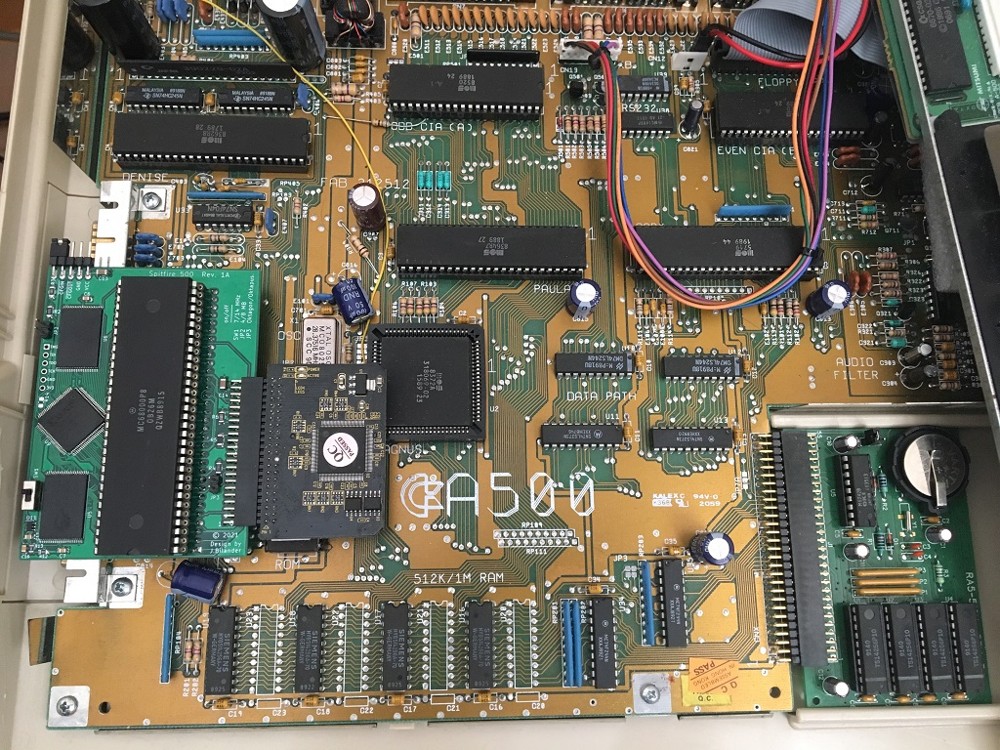
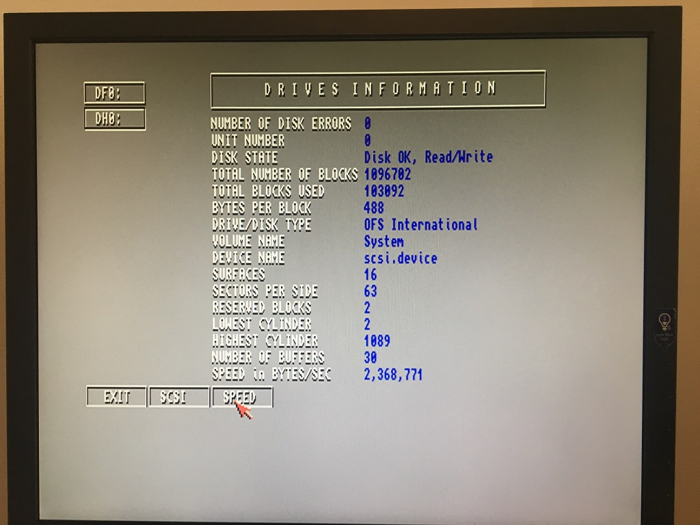

# SF500
Spitfire 500, A low-end 14 MHz Accelerator with IDE and 4/8 MB fast RAM for the Amiga 500.
***
THIS IS WORK IN PROGRESS!!!

KiCad files not added yet and won't be until Rev. 1B is verified working.

***
Heavily inspired by Matthias Heinrichs' CDTV-RAM-IDE board. Many thanks to Matze for sharing his work and letting me open source this project.

https://gitlab.com/MHeinrichs/CDTV-RAM-IDE/

Please note, if you are going to build boards and sell for profit, you will need a consent from Matthias and also from Oliver Kastl if you are going to bundle this software http://aminet.net/package/disk/misc/oktapus with the hardware (ROM-chip).
***

Video:
https://drive.google.com/file/d/1c2K9_kcEqxMMBJBd1aELfbt1fV5XXoU6/view?usp=sharing

***

 

BOM Rev. 1B
---------
Position  | Name/Value   | Package | Notes
-|-|-|-|
U1 | 64Pcs socket pins for Round Plug 0.5mm Diameter | 100Pcs | IC Leads Receptacle, gold or nickel plated, used as TH Pin Header. https://www.aliexpress.com/item/1005002830101899.html
U2 | CPU Socket, 2 x 32 Female Pin Header 2.54mm pitch | 2 x Single Row 40Pin | Round Female Pin Header gold or nickel plated machined pins.

 
 

[![CC BY-SA 4.0][cc-by-sa-shield]][cc-by-sa]

This work is licensed under a
[Creative Commons Attribution-ShareAlike 4.0 International License][cc-by-sa].

[![CC BY-SA 4.0][cc-by-sa-image]][cc-by-sa]

[cc-by-sa]: http://creativecommons.org/licenses/by-sa/4.0/
[cc-by-sa-image]: https://licensebuttons.net/l/by-sa/4.0/88x31.png
[cc-by-sa-shield]: https://img.shields.io/badge/License-CC%20BY--SA%204.0-lightgrey.svg
